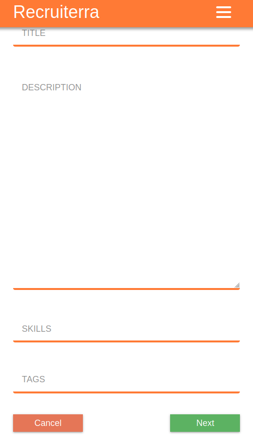

# <a href="https://protected-escarpment-75476.herokuapp.com">Recruiterra</a>

[](https://nodejs.org/en/)
[](https://reactjs.org/)

|                              Desktop View                              |                                   Mobile                                   |
| :--------------------------------------------------------------------: | :------------------------------------------------------------------------: |
|          |                 |
|  |  |


Recruiterra is a fully responsive web app built with MERN stack. The app simplifies a job hiring process to simple steps of job post reation. Job posts are automatically matches to the right candidates.

## Goals

- Improve React skills
- Practice Redux and Redux Form
- Get familiar with full stack development and architecture
- Develop a project with real-life applications
- Connect a front-end Create-React-App server to a NodeJS and Express backend
- Practice Node.js skills
- Practice Google OAuth with Passport.js
- Practice MongoDB with MongooseJS skills
- Learn to handle payments with Stripe
- Improve HTML and CSS skills
- Improve JavaScript skills

## Implementation

- Editor: VS Code
- Formatting: Prettier
- Front-end: React with multiple dependencies such as React Router
- Back-end: Node.js with Express server
- Database: Atlas MongoDB
- Authentication: Passport.js and Google OAuth
- Payments: Stripe

## Getting Started

These instructions will get you a copy of the project up and running on your local machine for development and testing purposes. See deployment for notes on how to deploy the project on a live system.

### Prerequisites

```
Node
React
Google account - for Google OAuth
Atlas MongoDB account - for database
SendGrid account - for email managnment
Stripe account - for payments
Heroku - for deployment

```

### Installing

1. Clone the repo

```
git clone https://github.com/serCJm/recruiterra.git
```

2. Change into the client directory and delete the package-lock.json and run a fresh npm install

3. Add your dev.js file with all of your keys to the config/ directory

```
module.exports = {
  googleClientID: 'YOUR-GOOGLE-CLIENT-ID'
  googleClientSecret: 'YOUR-GOOGLE-CLIENT-SECRET'
  mongoURI: 'YOUR-MONGO-URI'
  cookieKey: 'YOUR-COOKIE-KEY'
  stripePublishableKey: 'YOUR-STRIPE-PUB-KEY'
  stripeSecretKey: 'YOUR-STRIPE-SECRET-KEY'
  sendGridKey: 'YOUR-SENDGRID-KEY'
  templateRedirectDomain: 'http://localhost:YOUR-PORT'
};
```

5. In the root of the server directory run npm

```
npm run dev
```

6. Go to localhost:3000

## Deployment

Deploy to your heroku account

```
git push heroku master
```


## Authors

- CJ Moro [@cjmoro](https://github.com/serCJm)